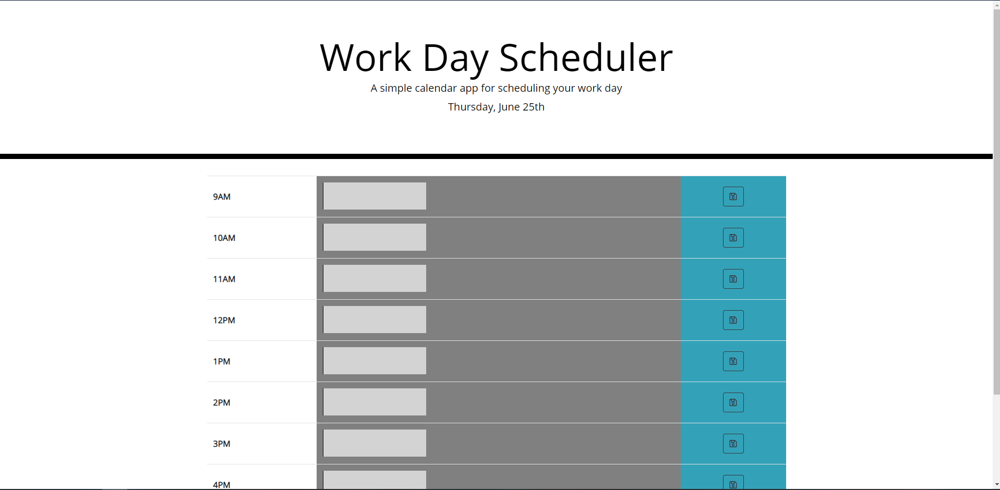

# Work-Day-Scheduler

This is my Work-Day-Scheduler.

## Link to the website

My live deployment of Work-Day-Scheduler is located here: <https://eelektrick.github.io/work-day-scheduler/>

## My Journey with javescript for the Work-Day-Scheduler

Due to my last assignment taking me all the way up to the due date I only had 4 free nights to complete this assignment and was stressed about it.

however when googling what others have done I saw someone use a responsive table from bootstrap and though it looked better and cleaner than using divs.

Everything went well until trying to get the info to show on the webpage and save and realized thanks to Daves help, I needed to go further than just siblings to get the info.

Besides 2 lines of code this assignment was easy to create off what was already given to us with basic css and html.

## How to use the Work-Day-Scheduler

First the webpage show the current day of the month, the month, and the day of the week always.

To change the schedule you need to choose the hour of the day you have plans and type out in the text area.

Next you hit the save button to the right and the information is saved.

When you hit the reload button the information stays where and what you typed.
